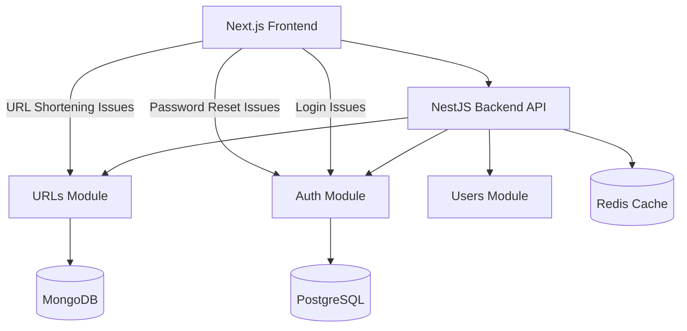

# Backend Integration Fixes Design

## Overview

This design document addresses the critical backend integration issues identified during comprehensive frontend testing. The analysis shows that the NestJS backend has a solid architecture but several endpoints are experiencing validation errors, server errors, or missing implementations that prevent the frontend from functioning correctly.

The main issues to resolve are:
1. **Login Authentication** - 400 validation errors preventing user login
2. **URL Shortening Service** - 500 server errors indicating missing or broken implementation
3. **Password Reset Functionality** - 500 server errors in the forgot password flow
4. **API Response Consistency** - Ensuring proper error handling and response formats
5. **Error Handling** - Improving user experience with clear error messages

## Architecture

### Current Backend Architecture
The NestJS backend follows a modular architecture with:
- **Auth Module**: Handles authentication, registration, and token management
- **URLs Module**: Manages URL shortening and analytics
- **Users Module**: User management and profile operations
- **Common Module**: Shared utilities, guards, filters, and interceptors

### Integration Points


## Components and Interfaces

### 1. Authentication Service Fixes

#### Current Issues Analysis
- **Login Endpoint**: Returns 400 validation errors despite correct request format
- **Response Format**: Backend returns `access_token` but frontend expects `tokens.accessToken`
- **Validation**: Potential issues with DTO validation or service logic

#### Design Solution
```typescript
// Enhanced LoginDto with better validation
export class LoginDto {
  @IsEmail({}, { message: 'Please provide a valid email address' })
  @ApiProperty({ example: 'user@example.com' })
  email: string;

  @IsString({ message: 'Password must be a string' })
  @MinLength(6, { message: 'Password must be at least 6 characters long' })
  @ApiProperty({ example: 'password123', minLength: 6 })
  password: string;
}

// Standardized Auth Response
export interface AuthResponse {
  access_token: string;
  refresh_token: string;
  user: {
    id: string;
    email: string;
    name: string;
    role: string;
  };
}
```

#### Implementation Strategy
1. **Validate Current DTO**: Ensure LoginDto validation is working correctly
2. **Debug Service Logic**: Add comprehensive logging to identify validation failures
3. **Test Database Connection**: Verify user lookup and password comparison
4. **Standardize Responses**: Ensure consistent response format across all auth endpoints

### 2. URL Shortening Service Implementation

#### Current Issues Analysis
- **500 Server Error**: Indicates missing implementation or runtime errors
- **Service Logic**: May have incomplete CRUD operations or database connection issues
- **DTO Validation**: Potential issues with CreateUrlDto validation

#### Design Solution
```typescript
// Enhanced CreateUrlDto
export class CreateUrlDto {
  @IsUrl({}, { message: 'Please provide a valid URL' })
  @ApiProperty({ example: 'https://www.example.com' })
  originalUrl: string;

  @IsOptional()
  @IsString()
  @Length(3, 20, { message: 'Custom back-half must be between 3 and 20 characters' })
  @Matches(/^[a-zA-Z0-9-_]+$/, { message: 'Custom back-half can only contain letters, numbers, hyphens, and underscores' })
  @ApiProperty({ required: false, example: 'my-link' })
  customBackHalf?: string;

  @IsOptional()
  @IsString()
  @ApiProperty({ required: false, example: 'My Important Link' })
  title?: string;

  @IsOptional()
  @IsArray()
  @IsString({ each: true })
  @ApiProperty({ required: false, example: ['work', 'important'] })
  tags?: string[];
}

// URL Response Interface
export interface UrlResponse {
  id: string;
  originalUrl: string;
  shortCode: string;
  shortUrl: string;
  title?: string;
  tags?: string[];
  clickCount: number;
  isActive: boolean;
  createdAt: Date;
  updatedAt: Date;
}
```

#### Implementation Strategy
1. **Verify Service Methods**: Ensure all CRUD operations are properly implemented
2. **Database Connection**: Verify MongoDB connection and schema validation
3. **Short Code Generation**: Implement robust unique short code generation
4. **Error Handling**: Add comprehensive error handling for all edge cases
5. **Validation Pipeline**: Ensure proper DTO validation and transformation

### 3. Password Reset Service Implementation

#### Current Issues Analysis
- **500 Server Error**: Indicates missing email service or incomplete implementation
- **Email Integration**: May lack proper email service configuration
- **Token Generation**: Potential issues with reset token generation and storage

#### Design Solution
```typescript
// Password Reset DTOs
export class ForgotPasswordDto {
  @IsEmail({}, { message: 'Please provide a valid email address' })
  @ApiProperty({ example: 'user@example.com' })
  email: string;
}

export class ResetPasswordDto {
  @IsString()
  @ApiProperty({ example: 'reset-token-here' })
  token: string;

  @IsString()
  @MinLength(8, { message: 'Password must be at least 8 characters long' })
  @Matches(/^(?=.*[a-z])(?=.*[A-Z])(?=.*\d)/, { 
    message: 'Password must contain at least one lowercase letter, one uppercase letter, and one number' 
  })
  @ApiProperty({ example: 'NewPassword123!' })
  newPassword: string;
}

// Password Reset Service Interface
export interface PasswordResetService {
  generateResetToken(email: string): Promise<string>;
  validateResetToken(token: string): Promise<boolean>;
  resetPassword(token: string, newPassword: string): Promise<void>;
  sendResetEmail(email: string, token: string): Promise<void>;
}
```

#### Implementation Strategy
1. **Email Service Integration**: Configure and test email service (Nodemailer/SendGrid)
2. **Token Management**: Implement secure token generation with expiration
3. **Database Storage**: Store reset tokens with user association and expiration
4. **Security Measures**: Implement rate limiting and token validation
5. **Email Templates**: Create professional password reset email templates

### 4. Error Handling and Response Standardization

#### Design Solution
```typescript
// Standardized Error Response
export interface ErrorResponse {
  statusCode: number;
  message: string | string[];
  error: string;
  timestamp: string;
  path: string;
  details?: any;
}

// Global Exception Filter
@Catch()
export class GlobalExceptionFilter implements ExceptionFilter {
  catch(exception: unknown, host: ArgumentsHost) {
    const ctx = host.switchToHttp();
    const response = ctx.getResponse<Response>();
    const request = ctx.getRequest<Request>();

    let status = HttpStatus.INTERNAL_SERVER_ERROR;
    let message = 'Internal server error';
    let details = null;

    if (exception instanceof HttpException) {
      status = exception.getStatus();
      const exceptionResponse = exception.getResponse();
      
      if (typeof exceptionResponse === 'object') {
        message = (exceptionResponse as any).message || message;
        details = (exceptionResponse as any).details;
      } else {
        message = exceptionResponse;
      }
    }

    const errorResponse: ErrorResponse = {
      statusCode: status,
      message,
      error: HttpStatus[status] || 'Unknown Error',
      timestamp: new Date().toISOString(),
      path: request.url,
      ...(details && { details }),
    };

    response.status(status).json(errorResponse);
  }
}
```

## Data Models

### Enhanced User Entity
```typescript
@Entity('users')
export class User {
  @PrimaryGeneratedColumn('uuid')
  id: string;

  @Column({ unique: true })
  email: string;

  @Column()
  name: string;

  @Column()
  passwordHash: string;

  @Column({ default: 'user' })
  role: string;

  @Column({ default: true })
  isActive: boolean;

  @Column({ nullable: true })
  emailVerifiedAt: Date;

  @Column({ nullable: true })
  passwordResetToken: string;

  @Column({ nullable: true })
  passwordResetExpires: Date;

  @CreateDateColumn()
  createdAt: Date;

  @UpdateDateColumn()
  updatedAt: Date;
}
```

### Enhanced URL Schema (MongoDB)
```typescript
@Schema({ timestamps: true })
export class Url {
  @Prop({ required: true })
  originalUrl: string;

  @Prop({ required: true, unique: true })
  shortCode: string;

  @Prop({ required: true })
  userId: string;

  @Prop()
  title?: string;

  @Prop([String])
  tags?: string[];

  @Prop({ default: 0 })
  clickCount: number;

  @Prop({ default: true })
  isActive: boolean;

  @Prop()
  expiresAt?: Date;

  @Prop()
  password?: string;

  @Prop({ type: Object })
  analytics?: {
    totalClicks: number;
    uniqueClicks: number;
    clicksByDate: Map<string, number>;
    clicksByCountry: Map<string, number>;
    clicksByDevice: Map<string, number>;
  };
}
```

## Error Handling

### Validation Error Handling
```typescript
// Custom Validation Pipe
@Injectable()
export class CustomValidationPipe extends ValidationPipe {
  constructor() {
    super({
      exceptionFactory: (errors: ValidationError[]) => {
        const messages = errors.map(error => ({
          field: error.property,
          errors: Object.values(error.constraints || {}),
        }));
        
        return new BadRequestException({
          message: 'Validation failed',
          details: messages,
        });
      },
    });
  }
}
```

### Service Error Handling
```typescript
// Auth Service Error Handling
async login(loginDto: LoginDto): Promise<AuthResponse> {
  try {
    const user = await this.validateUser(loginDto.email, loginDto.password);
    if (!user) {
      throw new UnauthorizedException('Invalid email or password');
    }

    // Generate tokens and return response
    return await this.generateAuthResponse(user);
  } catch (error) {
    if (error instanceof UnauthorizedException) {
      throw error;
    }
    
    this.logger.error('Login error:', error);
    throw new InternalServerErrorException('Login failed. Please try again.');
  }
}
```

## Testing Strategy

### Unit Testing
- **Service Layer Testing**: Test all service methods with mocked dependencies
- **Controller Testing**: Test all endpoints with proper request/response validation
- **DTO Validation Testing**: Test all validation rules and error messages
- **Error Handling Testing**: Test all error scenarios and response formats

### Integration Testing
- **Database Integration**: Test database operations with test databases
- **Email Service Integration**: Test email sending with mock email service
- **Authentication Flow**: Test complete auth flow from registration to login
- **URL Operations**: Test complete URL CRUD operations

### End-to-End Testing
- **Frontend Integration**: Test frontend-backend integration with real API calls
- **Authentication Persistence**: Test token storage and refresh mechanisms
- **Error Scenarios**: Test error handling from frontend perspective
- **Performance Testing**: Test API performance under load

### Testing Implementation
```typescript
// Example Service Test
describe('AuthService', () => {
  let service: AuthService;
  let usersService: jest.Mocked<UsersService>;

  beforeEach(async () => {
    const module = await Test.createTestingModule({
      providers: [
        AuthService,
        { provide: UsersService, useValue: mockUsersService },
        { provide: JwtService, useValue: mockJwtService },
      ],
    }).compile();

    service = module.get<AuthService>(AuthService);
    usersService = module.get(UsersService);
  });

  describe('login', () => {
    it('should return auth response for valid credentials', async () => {
      const loginDto = { email: 'test@example.com', password: 'password123' };
      const mockUser = { id: '1', email: 'test@example.com', name: 'Test User' };
      
      usersService.findByEmail.mockResolvedValue(mockUser);
      jest.spyOn(service, 'comparePassword').mockResolvedValue(true);

      const result = await service.login(loginDto);

      expect(result).toHaveProperty('access_token');
      expect(result).toHaveProperty('refresh_token');
      expect(result.user.email).toBe(loginDto.email);
    });

    it('should throw UnauthorizedException for invalid credentials', async () => {
      const loginDto = { email: 'test@example.com', password: 'wrongpassword' };
      
      usersService.findByEmail.mockResolvedValue(null);

      await expect(service.login(loginDto)).rejects.toThrow(UnauthorizedException);
    });
  });
});
```

## Implementation Plan

### Phase 1: Authentication Fixes (Priority: High)
1. Debug and fix login validation issues
2. Standardize authentication response format
3. Implement comprehensive error handling
4. Add detailed logging for debugging

### Phase 2: URL Shortening Implementation (Priority: High)
1. Complete URL service implementation
2. Fix database connection and schema issues
3. Implement proper validation and error handling
4. Add comprehensive testing

### Phase 3: Password Reset Implementation (Priority: Medium)
1. Implement email service integration
2. Create password reset token management
3. Build secure reset flow with proper validation
4. Add email templates and user notifications

### Phase 4: Error Handling and Monitoring (Priority: Medium)
1. Implement global exception filter
2. Standardize all API responses
3. Add comprehensive logging and monitoring
4. Implement rate limiting and security measures

### Phase 5: Testing and Validation (Priority: High)
1. Create comprehensive test suite
2. Perform integration testing with frontend
3. Validate all error scenarios
4. Performance testing and optimization

This design ensures that all backend integration issues are systematically addressed while maintaining the existing architecture and improving overall system reliability.