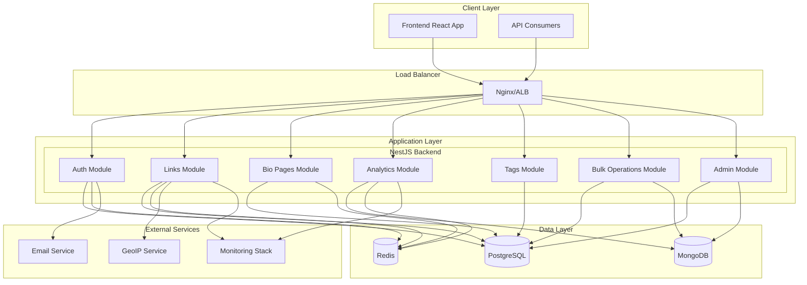

# Design Document

## Overview

This design document outlines the modernization of the NestJS backend to support advanced URL shortening features with enterprise-grade scalability, monitoring, and developer experience. The system will implement a hybrid database architecture using PostgreSQL for relational data, MongoDB for document storage, and Redis for high-performance caching.

The architecture follows microservices principles within a modular monolith approach, enabling independent scaling of components while maintaining development simplicity. The system emphasizes observability, security, and developer productivity through comprehensive tooling and automation.

## Architecture

### High-Level Architecture



### Database Architecture Strategy

The system employs a hybrid database approach optimized for different data patterns:

**PostgreSQL (Primary Relational Store)**
- User accounts and authentication data
- Link metadata and relationships
- Bio pages and structured content
- Tags and categorization
- Geo-targeting rules
- Transactional data requiring ACID compliance

**MongoDB (Document Store)**
- Analytics events and click tracking
- Bulk operation logs and temporary data
- Flexible schema data that may evolve
- Large JSON payloads and nested structures

**Redis (Cache and Session Store)**
- Session management and JWT blacklisting
- Frequently accessed link data
- Rate limiting counters
- Real-time analytics aggregations
- Pub/sub for real-time notifications

### Module Architecture

Each module follows the NestJS modular architecture pattern with clear separation of concerns:

```
src/modules/{module-name}/
├── controllers/          # HTTP request handlers
├── services/            # Business logic
├── entities/            # Database entities (TypeORM/Mongoose)
├── dto/                 # Data transfer objects
├── guards/              # Authorization guards
├── interceptors/        # Request/response interceptors
├── pipes/               # Validation pipes
├── decorators/          # Custom decorators
├── interfaces/          # TypeScript interfaces
├── constants/           # Module constants
└── {module}.module.ts   # Module definition
```

## Components and Interfaces

### Core Modules

#### 1. Enhanced Links Module

**Responsibilities:**
- Advanced link creation with custom aliases
- Device-specific URL routing (iOS/Android)
- UTM parameter management
- Link expiration handling
- Password protection
- Geo-targeting rules
- Tracking pixel integration

**Key Services:**
- `LinksService`: Core link management
- `PasswordProtectionService`: Secure password handling
- `GeoTargetingService`: Location-based routing
- `DeviceDetectionService`: User agent parsing
- `TrackingPixelService`: Third-party pixel management

**Database Schema (PostgreSQL):**
```sql
CREATE TABLE links (
    id UUID PRIMARY KEY DEFAULT gen_random_uuid(),
    user_id UUID NOT NULL REFERENCES users(id) ON DELETE CASCADE,
    original_url TEXT NOT NULL,
    short_code VARCHAR(10) UNIQUE NOT NULL,
    custom_alias VARCHAR(50) UNIQUE,
    title VARCHAR(255),
    is_active BOOLEAN DEFAULT true,
    expires_at TIMESTAMP,
    password_hash VARCHAR(255),
    password_hint VARCHAR(255),
    ios_url TEXT,
    android_url TEXT,
    utm_source VARCHAR(100),
    utm_medium VARCHAR(100),
    utm_campaign VARCHAR(100),
    utm_term VARCHAR(100),
    utm_content VARCHAR(100),
    meta_pixel_id VARCHAR(50),
    google_analytics_id VARCHAR(50),
    tiktok_pixel_id VARCHAR(50),
    created_at TIMESTAMP DEFAULT CURRENT_TIMESTAMP,
    updated_at TIMESTAMP DEFAULT CURRENT_TIMESTAMP
);

CREATE TABLE geo_rules (
    id UUID PRIMARY KEY DEFAULT gen_random_uuid(),
    link_id UUID NOT NULL REFERENCES links(id) ON DELETE CASCADE,
    country_code VARCHAR(2) NOT NULL,
    redirect_url TEXT NOT NULL,
    created_at TIMESTAMP DEFAULT CURRENT_TIMESTAMP
);

CREATE INDEX idx_links_short_code ON links(short_code);
CREATE INDEX idx_links_user_id ON links(user_id);
CREATE INDEX idx_links_expires_at ON links(expires_at) WHERE expires_at IS NOT NULL;
CREATE INDEX idx_geo_rules_link_id ON geo_rules(link_id);
```

#### 2. Bio Pages Module

**Responsibilities:**
- Bio page creation and management
- Customizable themes and styling
- Bio link ordering and management
- Public/private visibility control
- Username uniqueness validation

**Key Services:**
- `BioPageService`: Bio page management
- `BioLinksService`: Bio link management
- `ThemeService`: Theme customization

**Database Schema (PostgreSQL):**
```sql
CREATE TABLE bio_pages (
    id UUID PRIMARY KEY DEFAULT gen_random_uuid(),
    user_id UUID NOT NULL REFERENCES users(id) ON DELETE CASCADE,
    username VARCHAR(50) UNIQUE NOT NULL,
    title VARCHAR(100),
    bio TEXT,
    avatar_url TEXT,
    theme VARCHAR(20) DEFAULT 'default',
    background_color VARCHAR(7) DEFAULT '#ffffff',
    text_color VARCHAR(7) DEFAULT '#000000',
    button_style VARCHAR(20) DEFAULT 'rounded',
    is_public BOOLEAN DEFAULT true,
    created_at TIMESTAMP DEFAULT CURRENT_TIMESTAMP,
    updated_at TIMESTAMP DEFAULT CURRENT_TIMESTAMP
);

CREATE TABLE bio_links (
    id UUID PRIMARY KEY DEFAULT gen_random_uuid(),
    bio_page_id UUID NOT NULL REFERENCES bio_pages(id) ON DELETE CASCADE,
    title VARCHAR(100) NOT NULL,
    url TEXT NOT NULL,
    icon VARCHAR(50),
    position INTEGER NOT NULL,
    is_active BOOLEAN DEFAULT true,
    created_at TIMESTAMP DEFAULT CURRENT_TIMESTAMP,
    updated_at TIMESTAMP DEFAULT CURRENT_TIMESTAMP
);

CREATE INDEX idx_bio_pages_username ON bio_pages(username);
CREATE INDEX idx_bio_pages_user_id ON bio_pages(user_id);
CREATE INDEX idx_bio_links_bio_page_id ON bio_links(bio_page_id);
CREATE INDEX idx_bio_links_position ON bio_links(bio_page_id, position);
```

#### 3. Advanced Analytics Module

**Responsibilities:**
- Click event tracking and storage
- Device, browser, and OS detection
- Geographic location tracking
- Real-time analytics aggregation
- Historical analytics reporting
- Performance metrics collection

**Key Services:**
- `AnalyticsService`: Core analytics processing
- `ClickTrackingService`: Click event handling
- `GeoLocationService`: IP-based location detection
- `DeviceParsingService`: User agent analysis
- `ReportingService`: Analytics report generation

**Database Schema (MongoDB):**
```javascript
// clicks collection
{
  _id: ObjectId,
  linkId: String,
  userId: String,
  clickedAt: Date,
  ipHash: String,
  userAgent: String,
  browser: String,
  device: String,
  os: String,
  country: String,
  city: String,
  referrer: String,
  utmSource: String,
  utmMedium: String,
  utmCampaign: String,
  isBot: Boolean,
  sessionId: String
}

// analytics_aggregations collection
{
  _id: ObjectId,
  linkId: String,
  userId: String,
  date: Date,
  period: String, // 'hour', 'day', 'week', 'month'
  totalClicks: Number,
  uniqueClicks: Number,
  deviceBreakdown: {
    desktop: Number,
    mobile: Number,
    tablet: Number
  },
  countryBreakdown: Map,
  browserBreakdown: Map,
  referrerBreakdown: Map
}
```

#### 4. Tags Module

**Responsibilities:**
- Tag creation and management
- Color customization
- Link-tag associations
- Tag-based filtering and search

**Key Services:**
- `TagsService`: Tag management
- `TagAssociationService`: Link-tag relationships

**Database Schema (PostgreSQL):**
```sql
CREATE TABLE tags (
    id UUID PRIMARY KEY DEFAULT gen_random_uuid(),
    user_id UUID NOT NULL REFERENCES users(id) ON DELETE CASCADE,
    name VARCHAR(50) NOT NULL,
    color VARCHAR(7) DEFAULT '#6366f1',
    created_at TIMESTAMP DEFAULT CURRENT_TIMESTAMP,
    UNIQUE(user_id, name)
);

CREATE TABLE link_tags (
    id UUID PRIMARY KEY DEFAULT gen_random_uuid(),
    link_id UUID NOT NULL REFERENCES links(id) ON DELETE CASCADE,
    tag_id UUID NOT NULL REFERENCES tags(id) ON DELETE CASCADE,
    created_at TIMESTAMP DEFAULT CURRENT_TIMESTAMP,
    UNIQUE(link_id, tag_id)
);

CREATE INDEX idx_tags_user_id ON tags(user_id);
CREATE INDEX idx_link_tags_link_id ON link_tags(link_id);
CREATE INDEX idx_link_tags_tag_id ON link_tags(tag_id);
```

#### 5. Bulk Operations Module

**Responsibilities:**
- CSV import/export functionality
- Asynchronous processing of large datasets
- Progress tracking and error reporting
- Data validation and transformation

**Key Services:**
- `BulkImportService`: CSV import processing
- `BulkExportService`: Data export generation
- `ValidationService`: Data validation
- `ProgressTrackingService`: Operation progress monitoring

#### 6. Enhanced Authentication Module

**Responsibilities:**
- JWT-based authentication
- Password hashing and validation
- Email verification
- Password reset functionality
- Session management
- Rate limiting

**Key Services:**
- `AuthService`: Core authentication logic
- `JwtService`: Token management
- `EmailVerificationService`: Email verification
- `PasswordResetService`: Password reset handling

### Infrastructure Components

#### 1. Database Configuration Module

**Responsibilities:**
- Multi-database connection management
- Connection pooling optimization
- Health checks and monitoring
- Migration management

**Configuration:**
```typescript
// PostgreSQL Configuration
{
  type: 'postgres',
  host: process.env.POSTGRES_HOST,
  port: parseInt(process.env.POSTGRES_PORT),
  username: process.env.POSTGRES_USER,
  password: process.env.POSTGRES_PASSWORD,
  database: process.env.POSTGRES_DB,
  entities: ['dist/**/*.entity{.ts,.js}'],
  migrations: ['dist/migrations/*{.ts,.js}'],
  synchronize: false,
  logging: process.env.NODE_ENV === 'development',
  ssl: process.env.NODE_ENV === 'production',
  extra: {
    max: 20,
    idleTimeoutMillis: 30000,
    connectionTimeoutMillis: 2000,
  }
}

// MongoDB Configuration
{
  uri: process.env.MONGODB_URI,
  useNewUrlParser: true,
  useUnifiedTopology: true,
  maxPoolSize: 10,
  serverSelectionTimeoutMS: 5000,
  socketTimeoutMS: 45000,
}

// Redis Configuration
{
  host: process.env.REDIS_HOST,
  port: parseInt(process.env.REDIS_PORT),
  password: process.env.REDIS_PASSWORD,
  db: 0,
  retryDelayOnFailover: 100,
  enableReadyCheck: false,
  maxRetriesPerRequest: null,
  lazyConnect: true,
}
```

#### 2. Monitoring and Observability Module

**Responsibilities:**
- Health check endpoints
- Metrics collection and exposure
- Structured logging
- Distributed tracing
- Error tracking and alerting

**Key Services:**
- `HealthCheckService`: System health monitoring
- `MetricsService`: Performance metrics collection
- `LoggingService`: Structured logging
- `TracingService`: Request tracing

#### 3. Security Module

**Responsibilities:**
- Request validation and sanitization
- Rate limiting and throttling
- CORS configuration
- Security headers
- Input sanitization

**Key Components:**
- `ValidationPipe`: Input validation
- `SanitizationPipe`: Data sanitization
- `RateLimitGuard`: Request throttling
- `SecurityMiddleware`: Security headers

## Data Models

### Core Entities

#### User Entity (PostgreSQL)
```typescript
@Entity('users')
export class User {
  @PrimaryGeneratedColumn('uuid')
  id: string;

  @Column({ unique: true })
  email: string;

  @Column()
  passwordHash: string;

  @Column({ nullable: true })
  fullName: string;

  @Column({ nullable: true })
  username: string;

  @Column({ nullable: true })
  avatarUrl: string;

  @Column({ nullable: true })
  bio: string;

  @Column({ default: false })
  isEmailVerified: boolean;

  @Column({ nullable: true })
  emailVerificationToken: string;

  @Column({ nullable: true })
  passwordResetToken: string;

  @Column({ nullable: true })
  passwordResetExpires: Date;

  @CreateDateColumn()
  createdAt: Date;

  @UpdateDateColumn()
  updatedAt: Date;

  @OneToMany(() => Link, link => link.user)
  links: Link[];

  @OneToOne(() => BioPage, bioPage => bioPage.user)
  bioPage: BioPage;

  @OneToMany(() => Tag, tag => tag.user)
  tags: Tag[];
}
```

#### Link Entity (PostgreSQL)
```typescript
@Entity('links')
export class Link {
  @PrimaryGeneratedColumn('uuid')
  id: string;

  @ManyToOne(() => User, user => user.links, { onDelete: 'CASCADE' })
  @JoinColumn({ name: 'user_id' })
  user: User;

  @Column()
  originalUrl: string;

  @Column({ unique: true, length: 10 })
  shortCode: string;

  @Column({ unique: true, nullable: true, length: 50 })
  customAlias: string;

  @Column({ nullable: true })
  title: string;

  @Column({ default: true })
  isActive: boolean;

  @Column({ nullable: true })
  expiresAt: Date;

  @Column({ nullable: true })
  passwordHash: string;

  @Column({ nullable: true })
  passwordHint: string;

  @Column({ nullable: true })
  iosUrl: string;

  @Column({ nullable: true })
  androidUrl: string;

  @Column({ nullable: true, length: 100 })
  utmSource: string;

  @Column({ nullable: true, length: 100 })
  utmMedium: string;

  @Column({ nullable: true, length: 100 })
  utmCampaign: string;

  @Column({ nullable: true, length: 100 })
  utmTerm: string;

  @Column({ nullable: true, length: 100 })
  utmContent: string;

  @Column({ nullable: true, length: 50 })
  metaPixelId: string;

  @Column({ nullable: true, length: 50 })
  googleAnalyticsId: string;

  @Column({ nullable: true, length: 50 })
  tiktokPixelId: string;

  @CreateDateColumn()
  createdAt: Date;

  @UpdateDateColumn()
  updatedAt: Date;

  @OneToMany(() => GeoRule, geoRule => geoRule.link)
  geoRules: GeoRule[];

  @ManyToMany(() => Tag, tag => tag.links)
  @JoinTable({
    name: 'link_tags',
    joinColumn: { name: 'link_id' },
    inverseJoinColumn: { name: 'tag_id' }
  })
  tags: Tag[];
}
```

#### Click Event Schema (MongoDB)
```typescript
@Schema({ collection: 'clicks', timestamps: true })
export class ClickEvent {
  @Prop({ required: true })
  linkId: string;

  @Prop({ required: true })
  userId: string;

  @Prop({ required: true })
  clickedAt: Date;

  @Prop({ required: true })
  ipHash: string;

  @Prop()
  userAgent: string;

  @Prop()
  browser: string;

  @Prop()
  device: string;

  @Prop()
  os: string;

  @Prop()
  country: string;

  @Prop()
  city: string;

  @Prop()
  referrer: string;

  @Prop()
  utmSource: string;

  @Prop()
  utmMedium: string;

  @Prop()
  utmCampaign: string;

  @Prop({ default: false })
  isBot: boolean;

  @Prop()
  sessionId: string;
}
```

Now I'll use the prework tool to analyze the acceptance criteria before writing the correctness properties:
## Correctness Properties

*A property is a characteristic or behavior that should hold true across all valid executions of a system—essentially, a formal statement about what the system should do. Properties serve as the bridge between human-readable specifications and machine-verifiable correctness guarantees.*

### Property Reflection

After analyzing all acceptance criteria, I identified several areas where properties could be consolidated to eliminate redundancy and provide more comprehensive validation:

- **Link Management Properties**: Combined alias uniqueness, expiration handling, and device routing into comprehensive link lifecycle properties
- **Authentication Properties**: Consolidated password hashing, JWT handling, and security validation into unified authentication properties  
- **Analytics Properties**: Combined data capture, aggregation, and reporting into comprehensive analytics properties
- **Database Properties**: Unified connection pooling, caching, and performance optimization into database efficiency properties
- **API Properties**: Combined REST compliance, error handling, and HTTP standards into unified API design properties

### Core System Properties

**Property 1: Link Alias Uniqueness and Validation**
*For any* link creation request with a custom alias, the system should reject duplicates while accepting unique aliases, and all created links should have globally unique identifiers (either custom alias or generated short code)
**Validates: Requirements 1.1**

**Property 2: Link Expiration Lifecycle Management**
*For any* link with an expiration date, the system should automatically deactivate the link after expiration and prevent access to expired links during redirect attempts
**Validates: Requirements 1.2**

**Property 3: Device-Specific URL Routing**
*For any* link with iOS/Android URLs, when accessed by mobile devices, the system should route to the appropriate device-specific URL based on user agent detection
**Validates: Requirements 1.3**

**Property 4: UTM Parameter Preservation**
*For any* link with UTM parameters, all redirect responses should include the original UTM parameters appended to the destination URL
**Validates: Requirements 1.4**

**Property 5: Tracking Pixel Integration**
*For any* link with tracking pixel IDs (Meta, Google Analytics, TikTok), the system should include the pixel IDs in redirect responses and analytics data
**Validates: Requirements 1.5**

**Property 6: Comprehensive Analytics Data Capture**
*For any* link access, the system should capture and store all required analytics fields (browser, device, OS, location, referrer, timestamp) in the analytics database
**Validates: Requirements 1.6**

**Property 7: Password Protection Security**
*For any* password-protected link, the system should hash passwords using bcrypt, never store plain text passwords, and successfully verify correct passwords while rejecting incorrect ones
**Validates: Requirements 2.1, 2.3, 2.4**

**Property 8: Password Protection Access Control**
*For any* password-protected link access attempt, the system should deny access without valid password authentication and log all authentication attempts
**Validates: Requirements 2.2, 2.4**

**Property 9: Geo-Targeting Rule Processing**
*For any* link with geo-targeting rules, the system should detect user location via IP geolocation and redirect to country-specific URLs when rules match, falling back to default URL otherwise
**Validates: Requirements 3.2, 3.3, 3.4**

**Property 10: Geo-Targeting Decision Logging**
*For any* geo-targeting decision, the system should log the decision details including detected location, applied rule, and final redirect URL for analytics
**Validates: Requirements 3.5**

**Property 11: Bio Page Username Uniqueness**
*For any* bio page creation request, the system should enforce username uniqueness globally while allowing the same user to update their existing bio page
**Validates: Requirements 4.1**

**Property 12: Bio Link Ordering Atomicity**
*For any* bio link reordering operation, the system should update all link positions atomically, ensuring no partial state exists where positions are inconsistent
**Validates: Requirements 4.4**

**Property 13: Bio Page Visibility Control**
*For any* bio page access request, the system should serve only active bio links in correct position order, and enforce public/private visibility rules
**Validates: Requirements 4.5, 4.6**

**Property 14: Tag Management Scoped Uniqueness**
*For any* tag creation request, the system should enforce name uniqueness per user (allowing same tag names for different users) and maintain all tag-link associations correctly
**Validates: Requirements 5.1, 5.3**

**Property 15: Tag Deletion Cascade**
*For any* tag deletion, the system should remove all associated link-tag relationships atomically, ensuring no orphaned relationships remain
**Validates: Requirements 5.5**

**Property 16: Analytics Data Aggregation**
*For any* analytics request with time period parameters, the system should aggregate click data correctly by the specified time periods and provide accurate device, geographic, and referrer breakdowns
**Validates: Requirements 6.2, 6.3, 6.4**

**Property 17: Bulk Operations Data Validation**
*For any* CSV upload, the system should validate file format and data integrity, handle duplicate short codes gracefully, and provide detailed error reports for any validation failures
**Validates: Requirements 7.1, 7.2, 7.4**

**Property 18: Bulk Export Data Completeness**
*For any* bulk export request, the system should include all link metadata, analytics data, and associated relationships in the exported data
**Validates: Requirements 7.3**

**Property 19: System Health and Metrics Monitoring**
*For any* system monitoring request, the system should provide accurate health status, performance metrics, and resource utilization data in formats compatible with external monitoring tools
**Validates: Requirements 8.2, 8.4, 8.5**

**Property 20: Structured Error Logging**
*For any* system error, the system should log structured error information including context, stack traces, and correlation IDs for distributed tracing
**Validates: Requirements 8.3, 8.6**

**Property 21: Database Architecture Compliance**
*For any* data operation, the system should use the appropriate database (PostgreSQL for relational data, MongoDB for documents, Redis for caching) and maintain ACID properties for transactions
**Validates: Requirements 9.1, 9.2, 9.3**

**Property 22: Database Connection Efficiency**
*For any* database operation, the system should use connection pooling to optimize resource usage and support read replica routing for scaling read operations
**Validates: Requirements 9.4, 9.6**

**Property 23: Authentication Security**
*For any* user authentication, the system should validate email formats, enforce password policies, issue JWT tokens with proper expiration, and validate authentication for protected API requests
**Validates: Requirements 11.1, 11.2, 11.3**

**Property 24: Security Event Logging and Rate Limiting**
*For any* sensitive operation or rapid request pattern, the system should log security events and enforce rate limiting to prevent abuse
**Validates: Requirements 11.4, 11.5**

**Property 25: Stateless Application Design**
*For any* horizontal scaling operation, the system should maintain stateless behavior, allowing any instance to handle any request without session affinity requirements
**Validates: Requirements 12.4**

**Property 26: RESTful API Compliance**
*For any* API endpoint, the system should follow RESTful conventions, use proper HTTP status codes and headers, return consistent error response formats, and maintain backward compatibility across versions
**Validates: Requirements 13.1, 13.3, 13.4, 13.5**

**Property 27: API Rate Limiting and Analytics**
*For any* API request, the system should enforce rate limiting per client and track usage analytics for monitoring and billing purposes
**Validates: Requirements 13.6**

**Property 28: Test Coverage Completeness**
*For any* business logic code, the system should include unit tests, integration tests for external services, and property-based tests for complex algorithms
**Validates: Requirements 14.1, 14.2, 14.5**

**Property 29: Test Isolation and Reporting**
*For any* test execution, the system should use test containers for database isolation and generate comprehensive coverage reports and metrics
**Validates: Requirements 14.6, 14.4**

**Property 30: Caching Performance Optimization**
*For any* frequently accessed data request, the system should serve from Redis cache when available, populate cache on misses, and set appropriate HTTP cache headers for API responses
**Validates: Requirements 15.1, 15.2, 15.4**

**Property 31: Performance Monitoring and Optimization**
*For any* expensive database query or performance degradation, the system should implement query optimization techniques and trigger monitoring alerts
**Validates: Requirements 15.3, 15.6**

## Error Handling

### Error Classification

The system implements a comprehensive error handling strategy with structured error responses and proper HTTP status codes:

**Client Errors (4xx)**
- `400 Bad Request`: Invalid input data, malformed requests
- `401 Unauthorized`: Missing or invalid authentication
- `403 Forbidden`: Insufficient permissions
- `404 Not Found`: Resource not found
- `409 Conflict`: Duplicate resources (aliases, usernames)
- `422 Unprocessable Entity`: Validation failures
- `429 Too Many Requests`: Rate limiting exceeded

**Server Errors (5xx)**
- `500 Internal Server Error`: Unexpected server errors
- `502 Bad Gateway`: External service failures
- `503 Service Unavailable`: System overload or maintenance
- `504 Gateway Timeout`: External service timeouts

### Error Response Format

All errors follow a consistent JSON structure:

```typescript
interface ErrorResponse {
  error: {
    code: string;           // Machine-readable error code
    message: string;        // Human-readable error message
    details?: any;          // Additional error context
    timestamp: string;      // ISO 8601 timestamp
    requestId: string;      // Correlation ID for tracing
    path: string;          // Request path that caused error
  };
}
```

### Error Handling Strategies

**Database Errors**
- Connection failures: Automatic retry with exponential backoff
- Transaction failures: Automatic rollback and error logging
- Constraint violations: Mapped to appropriate HTTP status codes
- Timeout errors: Graceful degradation and circuit breaker patterns

**External Service Errors**
- GeoIP service failures: Fallback to default routing
- Email service failures: Queue for retry with dead letter handling
- Monitoring service failures: Local logging as backup

**Validation Errors**
- Input validation: Detailed field-level error messages
- Business rule violations: Clear explanation of violated constraints
- File upload errors: Specific feedback on format and size issues

### Circuit Breaker Implementation

For external service calls, the system implements circuit breaker patterns:

```typescript
@Injectable()
export class CircuitBreakerService {
  private circuits = new Map<string, CircuitBreaker>();

  async callWithCircuitBreaker<T>(
    serviceName: string,
    operation: () => Promise<T>,
    fallback?: () => Promise<T>
  ): Promise<T> {
    const circuit = this.getOrCreateCircuit(serviceName);
    
    try {
      return await circuit.fire(operation);
    } catch (error) {
      if (fallback) {
        return await fallback();
      }
      throw error;
    }
  }
}
```

## Testing Strategy

### Testing Pyramid

The system follows a comprehensive testing strategy with multiple layers:

**Unit Tests (70% of tests)**
- Test individual functions and methods in isolation
- Mock external dependencies
- Focus on business logic and edge cases
- Target: >90% code coverage for business logic

**Integration Tests (20% of tests)**
- Test interactions between modules
- Use test containers for database testing
- Test external service integrations
- Verify data flow between components

**End-to-End Tests (10% of tests)**
- Test complete user workflows
- Use real database instances
- Test critical business paths
- Verify system behavior from user perspective

### Property-Based Testing

For complex algorithms and business logic, the system uses property-based testing:

**Link Generation Properties**
```typescript
describe('Link Generation Properties', () => {
  it('should generate unique short codes', () => {
    fc.assert(fc.property(
      fc.integer({ min: 1, max: 1000 }),
      (count) => {
        const codes = Array.from({ length: count }, () => generateShortCode());
        const uniqueCodes = new Set(codes);
        return codes.length === uniqueCodes.size;
      }
    ), { numRuns: 100 });
  });
});
```

**Password Hashing Properties**
```typescript
describe('Password Hashing Properties', () => {
  it('should hash and verify passwords correctly', () => {
    fc.assert(fc.property(
      fc.string({ minLength: 8, maxLength: 128 }),
      async (password) => {
        const hash = await hashPassword(password);
        const isValid = await verifyPassword(password, hash);
        return isValid && hash !== password;
      }
    ), { numRuns: 100 });
  });
});
```

### Test Configuration

**Jest Configuration**
```typescript
module.exports = {
  moduleFileExtensions: ['js', 'json', 'ts'],
  rootDir: 'src',
  testRegex: '.*\\.spec\\.ts$',
  transform: {
    '^.+\\.(t|j)s$': 'ts-jest',
  },
  collectCoverageFrom: [
    '**/*.(t|j)s',
    '!**/*.spec.ts',
    '!**/*.interface.ts',
    '!**/node_modules/**',
  ],
  coverageDirectory: '../coverage',
  testEnvironment: 'node',
  setupFilesAfterEnv: ['<rootDir>/test/setup.ts'],
  testTimeout: 30000,
};
```

**Test Containers Setup**
```typescript
@Global()
@Module({})
export class TestDatabaseModule {
  static async forRoot(): Promise<DynamicModule> {
    const postgresContainer = await new PostgreSqlContainer()
      .withDatabase('test_db')
      .withUsername('test_user')
      .withPassword('test_password')
      .start();

    const mongoContainer = await new MongoDBContainer()
      .withReplicaSet()
      .start();

    const redisContainer = await new RedisContainer()
      .start();

    return {
      module: TestDatabaseModule,
      providers: [
        {
          provide: 'POSTGRES_CONNECTION',
          useValue: postgresContainer.getConnectionUri(),
        },
        {
          provide: 'MONGO_CONNECTION',
          useValue: mongoContainer.getConnectionString(),
        },
        {
          provide: 'REDIS_CONNECTION',
          useValue: redisContainer.getConnectionUrl(),
        },
      ],
      exports: ['POSTGRES_CONNECTION', 'MONGO_CONNECTION', 'REDIS_CONNECTION'],
    };
  }
}
```

### Test Execution Strategy

**Dual Testing Approach**
- **Unit tests**: Verify specific examples, edge cases, and error conditions using Jest
- **Property tests**: Verify universal properties across all inputs using fast-check
- Both approaches are complementary and necessary for comprehensive coverage

**Property-Based Test Configuration**
- Minimum 100 iterations per property test (due to randomization)
- Each property test references its design document property
- Tag format: **Feature: backend-modernization, Property {number}: {property_text}**

**Test Execution Commands**
```bash
# Run all tests
npm run test

# Run tests with coverage
npm run test:cov

# Run property-based tests specifically
npm run test:pbt

# Run integration tests
npm run test:integration

# Run e2e tests
npm run test:e2e
```

### Continuous Integration Testing

**GitHub Actions Workflow**
```yaml
name: Test Suite
on: [push, pull_request]

jobs:
  test:
    runs-on: ubuntu-latest
    services:
      postgres:
        image: postgres:15
        env:
          POSTGRES_PASSWORD: postgres
        options: >-
          --health-cmd pg_isready
          --health-interval 10s
          --health-timeout 5s
          --health-retries 5
      
      mongodb:
        image: mongo:7
        options: >-
          --health-cmd "mongosh --eval 'db.runCommand(\"ping\")'"
          --health-interval 10s
          --health-timeout 5s
          --health-retries 5
      
      redis:
        image: redis:7
        options: >-
          --health-cmd "redis-cli ping"
          --health-interval 10s
          --health-timeout 5s
          --health-retries 5

    steps:
      - uses: actions/checkout@v4
      - uses: actions/setup-node@v4
        with:
          node-version: '20'
          cache: 'npm'
      
      - run: npm ci
      - run: npm run lint
      - run: npm run test:cov
      - run: npm run test:e2e
      
      - name: Upload coverage reports
        uses: codecov/codecov-action@v3
        with:
          file: ./coverage/lcov.info
```

This comprehensive design provides enterprise-grade scalability, monitoring, security, and developer experience while supporting all the advanced features required by the new frontend. The hybrid database architecture, comprehensive testing strategy, and robust error handling ensure the system can handle production workloads reliably.