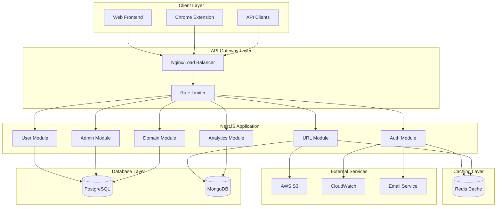

# NestJS Migration Design Document

## Overview

This design document outlines the architecture and implementation strategy for migrating the existing Express.js URL shortener to a modern, scalable NestJS v10 application. The new architecture will implement enterprise-level patterns including microservice-ready design, hybrid database architecture, comprehensive security, and advanced monitoring capabilities.

## Architecture

### High-Level Architecture



### Module Architecture

The application will be organized into the following core modules:

1. **Core Module**: Application bootstrap, configuration, and shared services
2. **Auth Module**: Authentication, authorization, and JWT management
3. **User Module**: User management, profiles, and preferences
4. **URL Module**: URL shortening, redirection, and management
5. **Admin Module**: Administrative functions and user management
6. **Domain Module**: Custom domain management and DNS validation
7. **Analytics Module**: Click tracking, statistics, and reporting
8. **Common Module**: Shared utilities, decorators, and pipes

## Components and Interfaces

### Database Design

#### Hybrid Database Strategy Rationale

The hybrid approach leverages the strengths of both databases:

**PostgreSQL for Structured, Relational Data:**
- User accounts, authentication, and admin data requiring ACID compliance
- Complex relationships (user-domain, user-permissions) with referential integrity
- Structured queries for business analytics and reporting
- Mature ecosystem for user management and admin interfaces

**MongoDB for High-Volume, Flexible Data:**
- URL records with high read/write ratios and horizontal scaling needs
- Click analytics as time-series data with flexible event properties
- Link-in-bio pages with varying content structures
- Geospatial analytics and flexible metadata storage

This separation allows optimal performance: PostgreSQL ensures data consistency for critical user data, while MongoDB provides the flexibility and scalability needed for high-volume URL operations and analytics.

#### PostgreSQL Schema (User Management)
```sql
-- Users table
CREATE TABLE users (
    id UUID PRIMARY KEY DEFAULT gen_random_uuid(),
    email VARCHAR(255) UNIQUE NOT NULL,
    password_hash VARCHAR(255) NOT NULL,
    name VARCHAR(255) NOT NULL,
    is_email_verified BOOLEAN DEFAULT FALSE,
    role VARCHAR(50) DEFAULT 'user',
    custom_domain_id UUID REFERENCES custom_domains(id),
    created_at TIMESTAMP DEFAULT CURRENT_TIMESTAMP,
    updated_at TIMESTAMP DEFAULT CURRENT_TIMESTAMP
);

-- Custom domains table
CREATE TABLE custom_domains (
    id UUID PRIMARY KEY DEFAULT gen_random_uuid(),
    domain VARCHAR(255) UNIQUE NOT NULL,
    user_id UUID REFERENCES users(id),
    is_verified BOOLEAN DEFAULT FALSE,
    dns_records JSONB,
    created_at TIMESTAMP DEFAULT CURRENT_TIMESTAMP,
    updated_at TIMESTAMP DEFAULT CURRENT_TIMESTAMP
);

-- Admin users table
CREATE TABLE admin_users (
    id UUID PRIMARY KEY DEFAULT gen_random_uuid(),
    email VARCHAR(255) UNIQUE NOT NULL,
    password_hash VARCHAR(255) NOT NULL,
    name VARCHAR(255) NOT NULL,
    permissions JSONB DEFAULT '[]',
    created_at TIMESTAMP DEFAULT CURRENT_TIMESTAMP,
    updated_at TIMESTAMP DEFAULT CURRENT_TIMESTAMP
);

-- Refresh tokens table
CREATE TABLE refresh_tokens (
    id UUID PRIMARY KEY DEFAULT gen_random_uuid(),
    user_id UUID REFERENCES users(id),
    token_hash VARCHAR(255) NOT NULL,
    expires_at TIMESTAMP NOT NULL,
    created_at TIMESTAMP DEFAULT CURRENT_TIMESTAMP
);
```

#### MongoDB Schema (URL Management)
```javascript
// URLs Collection
{
  _id: ObjectId,
  userId: String, // UUID from PostgreSQL
  shortCode: String, // indexed, unique
  originalUrl: String,
  customBackHalf: String, // optional
  category: String,
  visitCount: Number,
  isActive: Boolean,
  expiresAt: Date, // optional
  metadata: {
    title: String,
    description: String,
    favicon: String
  },
  createdAt: Date,
  updatedAt: Date
}

// Click Analytics Collection
{
  _id: ObjectId,
  urlId: ObjectId,
  userId: String,
  timestamp: Date,
  ipAddress: String, // hashed for privacy
  userAgent: String,
  referer: String,
  country: String,
  city: String,
  device: String,
  browser: String,
  os: String
}

// Link in Bio Pages Collection
{
  _id: ObjectId,
  userId: String,
  title: String,
  description: String,
  avatar: String,
  theme: String,
  links: [{
    title: String,
    url: String,
    isActive: Boolean,
    order: Number
  }],
  isPublic: Boolean,
  customSlug: String,
  createdAt: Date,
  updatedAt: Date
}
```

### Core Services Architecture

#### Authentication Service
```typescript
interface IAuthService {
  validateUser(email: string, password: string): Promise<User | null>;
  login(user: User): Promise<{ accessToken: string; refreshToken: string }>;
  refreshToken(refreshToken: string): Promise<{ accessToken: string }>;
  logout(userId: string, refreshToken: string): Promise<void>;
  validateJWT(token: string): Promise<JWTPayload>;
  hashPassword(password: string): Promise<string>;
  comparePassword(password: string, hash: string): Promise<boolean>;
}
```

#### URL Service
```typescript
interface IUrlService {
  createShortUrl(createUrlDto: CreateUrlDto): Promise<UrlEntity>;
  getOriginalUrl(shortCode: string): Promise<string>;
  getUserUrls(userId: string, pagination: PaginationDto): Promise<PaginatedResult<UrlEntity>>;
  updateUrl(id: string, updateUrlDto: UpdateUrlDto): Promise<UrlEntity>;
  deleteUrl(id: string): Promise<void>;
  getUrlAnalytics(id: string): Promise<UrlAnalytics>;
  generateShortCode(): string;
  validateCustomBackHalf(backHalf: string): boolean;
}
```

#### Cache Service
```typescript
interface ICacheService {
  get<T>(key: string): Promise<T | null>;
  set(key: string, value: any, ttl?: number): Promise<void>;
  del(key: string): Promise<void>;
  exists(key: string): Promise<boolean>;
  increment(key: string): Promise<number>;
  expire(key: string, ttl: number): Promise<void>;
}
```

### Security Implementation

#### JWT Strategy
```typescript
@Injectable()
export class JwtStrategy extends PassportStrategy(Strategy) {
  constructor(
    private configService: ConfigService,
    private authService: AuthService,
  ) {
    super({
      jwtFromRequest: ExtractJwt.fromAuthHeaderAsBearerToken(),
      ignoreExpiration: false,
      secretOrKey: configService.get('JWT_SECRET'),
    });
  }

  async validate(payload: JWTPayload): Promise<User> {
    return this.authService.validateJWTPayload(payload);
  }
}
```

#### Rate Limiting Configuration
```typescript
export const rateLimitConfig = {
  global: {
    windowMs: 15 * 60 * 1000, // 15 minutes
    max: 1000, // limit each IP to 1000 requests per windowMs
  },
  auth: {
    windowMs: 15 * 60 * 1000,
    max: 5, // limit login attempts
  },
  urlCreation: {
    windowMs: 60 * 1000, // 1 minute
    max: 10, // limit URL creation
  },
  urlAccess: {
    windowMs: 60 * 1000,
    max: 100, // limit URL redirections
  },
};
```

## Data Models

### User Entity (PostgreSQL)
```typescript
@Entity('users')
export class User {
  @PrimaryGeneratedColumn('uuid')
  id: string;

  @Column({ unique: true })
  email: string;

  @Column({ select: false })
  passwordHash: string;

  @Column()
  name: string;

  @Column({ default: false })
  isEmailVerified: boolean;

  @Column({ default: 'user' })
  role: UserRole;

  @ManyToOne(() => CustomDomain, { nullable: true })
  customDomain: CustomDomain;

  @CreateDateColumn()
  createdAt: Date;

  @UpdateDateColumn()
  updatedAt: Date;
}
```

### URL Document (MongoDB)
```typescript
@Schema({ timestamps: true })
export class Url {
  @Prop({ required: true, index: true })
  userId: string;

  @Prop({ required: true, unique: true, index: true })
  shortCode: string;

  @Prop({ required: true })
  originalUrl: string;

  @Prop()
  customBackHalf?: string;

  @Prop({ index: true })
  category?: string;

  @Prop({ default: 0, index: -1 })
  visitCount: number;

  @Prop({ default: true })
  isActive: boolean;

  @Prop()
  expiresAt?: Date;

  @Prop({ type: Object })
  metadata?: {
    title?: string;
    description?: string;
    favicon?: string;
  };

  @Prop()
  createdAt: Date;

  @Prop()
  updatedAt: Date;
}
```

## Error Handling

### Global Exception Filter
```typescript
@Catch()
export class GlobalExceptionFilter implements ExceptionFilter {
  private readonly logger = new Logger(GlobalExceptionFilter.name);

  catch(exception: unknown, host: ArgumentsHost) {
    const ctx = host.switchToHttp();
    const response = ctx.getResponse<Response>();
    const request = ctx.getRequest<Request>();

    let status = HttpStatus.INTERNAL_SERVER_ERROR;
    let message = 'Internal server error';

    if (exception instanceof HttpException) {
      status = exception.getStatus();
      message = exception.message;
    } else if (exception instanceof ValidationError) {
      status = HttpStatus.BAD_REQUEST;
      message = 'Validation failed';
    }

    const errorResponse = {
      statusCode: status,
      timestamp: new Date().toISOString(),
      path: request.url,
      message,
      ...(process.env.NODE_ENV === 'development' && { stack: exception.stack }),
    };

    this.logger.error(
      `${request.method} ${request.url}`,
      exception.stack,
      'GlobalExceptionFilter',
    );

    response.status(status).json(errorResponse);
  }
}
```

### Custom Exception Classes
```typescript
export class UrlNotFoundException extends NotFoundException {
  constructor(shortCode: string) {
    super(`URL with short code '${shortCode}' not found`);
  }
}

export class InvalidUrlException extends BadRequestException {
  constructor(url: string) {
    super(`Invalid URL format: ${url}`);
  }
}

export class RateLimitExceededException extends TooManyRequestsException {
  constructor(resource: string) {
    super(`Rate limit exceeded for ${resource}`);
  }
}
```

## Testing Strategy

### Testing Pyramid
1. **Unit Tests (70%)**
   - Service layer logic
   - Utility functions
   - Validators and pipes
   - Custom decorators

2. **Integration Tests (20%)**
   - Controller endpoints
   - Database operations
   - External service integrations
   - Authentication flows

3. **End-to-End Tests (10%)**
   - Complete user workflows
   - API contract testing
   - Performance testing
   - Security testing

### Test Configuration
```typescript
// test/app.e2e-spec.ts
describe('AppController (e2e)', () => {
  let app: INestApplication;
  let postgresContainer: StartedPostgreSqlContainer;
  let mongoContainer: StartedMongoDBContainer;
  let redisContainer: StartedRedisContainer;

  beforeAll(async () => {
    // Start test containers
    postgresContainer = await new PostgreSqlContainer().start();
    mongoContainer = await new MongoDBContainer().start();
    redisContainer = await new RedisContainer().start();

    const moduleFixture: TestingModule = await Test.createTestingModule({
      imports: [AppModule],
    })
      .overrideProvider(ConfigService)
      .useValue({
        get: jest.fn((key: string) => {
          const config = {
            DATABASE_URL: postgresContainer.getConnectionUri(),
            MONGODB_URI: mongoContainer.getConnectionString(),
            REDIS_URL: redisContainer.getConnectionUrl(),
          };
          return config[key];
        }),
      })
      .compile();

    app = moduleFixture.createNestApplication();
    await app.init();
  });

  afterAll(async () => {
    await app.close();
    await postgresContainer.stop();
    await mongoContainer.stop();
    await redisContainer.stop();
  });
});
```

## Performance Optimization

### Caching Strategy
1. **URL Resolution Cache**: Cache short code to original URL mappings (TTL: 1 hour)
2. **User Session Cache**: Cache user authentication data (TTL: 15 minutes)
3. **Analytics Cache**: Cache aggregated analytics data (TTL: 5 minutes)
4. **Metadata Cache**: Cache URL metadata (title, description) (TTL: 24 hours)

### Database Optimization
1. **Connection Pooling**: Configure optimal pool sizes for both databases
2. **Indexing Strategy**: Implement proper indexes for frequently queried fields
3. **Query Optimization**: Use database-specific optimizations and query analysis
4. **Read Replicas**: Configure read replicas for analytics queries

### Application Optimization
1. **Response Compression**: Enable gzip compression for API responses
2. **Request Validation**: Implement efficient validation pipes
3. **Lazy Loading**: Use lazy loading for non-critical modules
4. **Memory Management**: Implement proper memory management and garbage collection

## Security Measures

### Authentication & Authorization
- JWT with short-lived access tokens (15 minutes) and long-lived refresh tokens (7 days)
- Role-based access control (RBAC) with user and admin roles
- API key authentication for external integrations
- Multi-factor authentication support (future enhancement)

### Data Protection
- Password hashing using bcrypt with salt rounds >= 12
- Sensitive data encryption at rest
- PII data anonymization in analytics
- GDPR compliance for user data handling

### Network Security
- CORS configuration with domain whitelisting
- Helmet.js for security headers
- Rate limiting with Redis-based storage
- Input validation and sanitization
- SQL injection and NoSQL injection prevention

### Monitoring & Logging
- Structured logging with correlation IDs
- Security event logging and alerting
- Performance monitoring and alerting
- Health checks for all critical components

## Migration Strategy

### Phase 1: Infrastructure Setup
1. Set up NestJS project structure
2. Configure hybrid database connections
3. Implement basic authentication
4. Set up testing framework

### Phase 2: Core Feature Migration
1. Migrate URL shortening functionality
2. Migrate user management
3. Migrate admin functionality
4. Implement caching layer

### Phase 3: Advanced Features
1. Migrate analytics functionality
2. Implement custom domains
3. Add monitoring and logging
4. Performance optimization

### Phase 4: Production Deployment
1. Data migration scripts
2. Blue-green deployment
3. Performance testing
4. Security audit

## Technology Stack

### Core Framework
- **NestJS v10**: Main application framework
- **TypeScript**: Primary programming language
- **Node.js v18+**: Runtime environment

### Databases
- **PostgreSQL 15**: User management, authentication, admin data
- **MongoDB 6**: URL data, analytics, link-in-bio pages
- **Redis 7**: Caching and session storage

### Security & Authentication
- **Passport.js**: Authentication strategies
- **JWT**: Token-based authentication
- **bcrypt**: Password hashing
- **Helmet.js**: Security headers
- **class-validator**: Input validation

### Testing
- **Jest**: Unit and integration testing
- **Supertest**: API testing
- **Testcontainers**: Database testing
- **Artillery**: Load testing

### Monitoring & Logging
- **Winston**: Logging framework
- **Prometheus**: Metrics collection
- **AWS CloudWatch**: Production logging
- **Health checks**: Application monitoring

### Development Tools
- **ESLint**: Code linting
- **Prettier**: Code formatting
- **Husky**: Git hooks
- **Docker**: Containerization
- **Swagger/OpenAPI**: API documentation