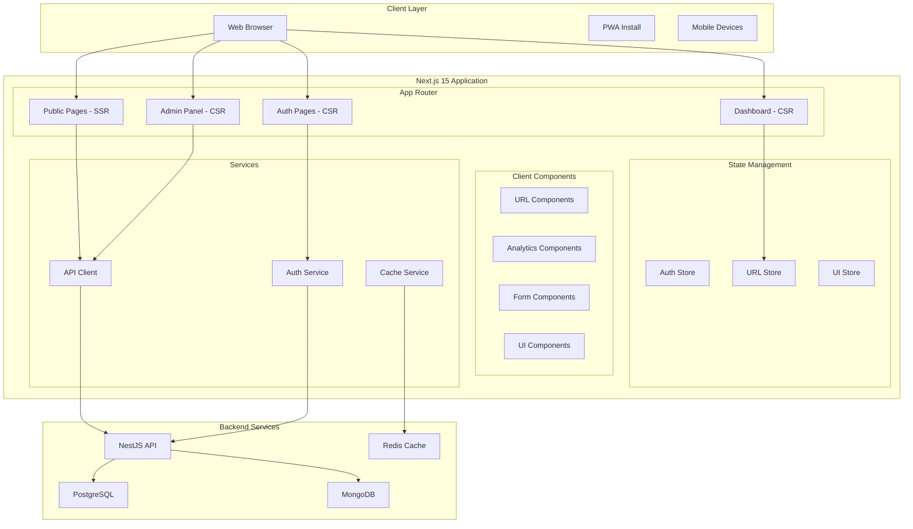

# Next.js 15 Frontend Design Document

## Overview

This design document outlines the architecture and implementation strategy for rebuilding the SnapURL frontend using Next.js 15. The new application will be a modern, scalable, and fully responsive web application that integrates seamlessly with the existing NestJS backend APIs. The design emphasizes performance, user experience, accessibility, and maintainability.

## Architecture

### High-Level Architecture



### Technology Stack

#### Core Framework
- **Next.js 15**: App Router, Server Components, Server Actions
- **React 18**: Client Components, Hooks, Suspense
- **TypeScript**: Type safety and developer experience

#### UI Framework & Styling
- **Material-UI v7**: Component library and design system
- **Tailwind CSS**: Utility-first CSS framework
- **Framer Motion**: Animations and transitions
- **React Hook Form**: Form handling and validation
- **Zod**: Schema validation

#### State Management & Data Fetching
- **Zustand**: Lightweight state management
- **TanStack Query**: Server state management and caching
- **SWR**: Data fetching with revalidation

#### Development & Testing
- **Jest**: Unit testing framework
- **React Testing Library**: Component testing
- **Playwright**: End-to-end testing
- **Storybook**: Component development and documentation
- **ESLint + Prettier**: Code quality and formatting

## Components and Interfaces

### Project Structure

```
nextjs-frontend/
├── src/
│   ├── app/                    # App Router pages
│   │   ├── (auth)/            # Auth route group
│   │   ├── (dashboard)/       # Dashboard route group
│   │   ├── (public)/          # Public route group
│   │   ├── admin/             # Admin pages
│   │   ├── globals.css        # Global styles
│   │   ├── layout.tsx         # Root layout
│   │   └── page.tsx           # Home page
│   ├── components/            # Reusable components
│   │   ├── ui/               # Base UI components
│   │   ├── forms/            # Form components
│   │   ├── charts/           # Analytics charts
│   │   ├── layout/           # Layout components
│   │   └── features/         # Feature-specific components
│   ├── lib/                  # Utilities and configurations
│   │   ├── api/              # API client and types
│   │   ├── auth/             # Authentication utilities
│   │   ├── utils/            # Helper functions
│   │   ├── validations/      # Zod schemas
│   │   └── constants/        # App constants
│   ├── stores/               # Zustand stores
│   ├── hooks/                # Custom React hooks
│   ├── types/                # TypeScript type definitions
│   └── styles/               # Additional styles
├── public/                   # Static assets
├── tests/                    # Test files
├── docs/                     # Documentation
└── .storybook/              # Storybook configuration
```

### Core Components Architecture

#### Authentication Components
```typescript
// components/auth/LoginForm.tsx
interface LoginFormProps {
  onSuccess?: () => void;
  redirectTo?: string;
}

// components/auth/SignupForm.tsx
interface SignupFormProps {
  onSuccess?: () => void;
  showTerms?: boolean;
}

// components/auth/AuthGuard.tsx
interface AuthGuardProps {
  children: React.ReactNode;
  fallback?: React.ReactNode;
  requireAuth?: boolean;
}
```

#### URL Management Components
```typescript
// components/urls/URLShortener.tsx
interface URLShortenerProps {
  onUrlCreated?: (url: URLData) => void;
  defaultCategory?: string;
  showAdvancedOptions?: boolean;
}

// components/urls/URLList.tsx
interface URLListProps {
  urls: URLData[];
  onEdit?: (url: URLData) => void;
  onDelete?: (id: string) => void;
  onAnalytics?: (id: string) => void;
  loading?: boolean;
}

// components/urls/URLCard.tsx
interface URLCardProps {
  url: URLData;
  showAnalytics?: boolean;
  showQRCode?: boolean;
  actions?: URLAction[];
}
```

#### Analytics Components
```typescript
// components/analytics/AnalyticsDashboard.tsx
interface AnalyticsDashboardProps {
  urlId?: string;
  dateRange?: DateRange;
  showComparison?: boolean;
}

// components/analytics/ClickChart.tsx
interface ClickChartProps {
  data: AnalyticsData[];
  type: 'line' | 'bar' | 'area';
  period: '24h' | '7d' | '30d' | '90d';
}

// components/analytics/GeographicMap.tsx
interface GeographicMapProps {
  data: GeographicData[];
  interactive?: boolean;
  showTooltips?: boolean;
}
```

### Data Models and Types

#### Core Types
```typescript
// types/auth.ts
interface User {
  id: string;
  email: string;
  name: string;
  isEmailVerified: boolean;
  role: 'user' | 'admin';
  customDomain?: CustomDomain;
  createdAt: string;
  updatedAt: string;
}

interface AuthTokens {
  accessToken: string;
  refreshToken: string;
  expiresIn: number;
}

// types/url.ts
interface URLData {
  id: string;
  userId: string;
  shortCode: string;
  originalUrl: string;
  customBackHalf?: string;
  category?: string;
  visitCount: number;
  isActive: boolean;
  expiresAt?: string;
  metadata?: URLMetadata;
  createdAt: string;
  updatedAt: string;
}

interface URLMetadata {
  title?: string;
  description?: string;
  favicon?: string;
  ogImage?: string;
}

// types/analytics.ts
interface AnalyticsData {
  urlId: string;
  totalClicks: number;
  uniqueClicks: number;
  clicksByDate: ClicksByDate[];
  topCountries: CountryData[];
  topDevices: DeviceData[];
  topBrowsers: BrowserData[];
  topReferrers: ReferrerData[];
}

interface ClicksByDate {
  date: string;
  clicks: number;
  uniqueClicks: number;
}
```

### API Integration Layer

#### API Client Configuration
```typescript
// lib/api/client.ts
class APIClient {
  private baseURL: string;
  private accessToken: string | null = null;

  constructor(baseURL: string) {
    this.baseURL = baseURL;
  }

  setAccessToken(token: string) {
    this.accessToken = token;
  }

  async request<T>(
    endpoint: string,
    options: RequestOptions = {}
  ): Promise<APIResponse<T>> {
    const url = `${this.baseURL}${endpoint}`;
    const headers = {
      'Content-Type': 'application/json',
      ...(this.accessToken && { Authorization: `Bearer ${this.accessToken}` }),
      ...options.headers,
    };

    const response = await fetch(url, {
      ...options,
      headers,
    });

    if (!response.ok) {
      throw new APIError(response.status, await response.text());
    }

    return response.json();
  }
}

// API service methods
export const authAPI = {
  login: (credentials: LoginCredentials) => 
    apiClient.request<AuthResponse>('/auth/login', {
      method: 'POST',
      body: JSON.stringify(credentials),
    }),
  
  register: (userData: RegisterData) =>
    apiClient.request<AuthResponse>('/auth/register', {
      method: 'POST',
      body: JSON.stringify(userData),
    }),
  
  refreshToken: (refreshToken: string) =>
    apiClient.request<TokenResponse>('/auth/refresh', {
      method: 'POST',
      body: JSON.stringify({ refreshToken }),
    }),
};

export const urlAPI = {
  createUrl: (urlData: CreateURLData) =>
    apiClient.request<URLData>('/urls', {
      method: 'POST',
      body: JSON.stringify(urlData),
    }),
  
  getUserUrls: (params: URLListParams) =>
    apiClient.request<PaginatedResponse<URLData>>('/urls', {
      method: 'GET',
      params,
    }),
  
  getUrlAnalytics: (id: string, period?: string) =>
    apiClient.request<AnalyticsData>(`/urls/${id}/analytics`, {
      method: 'GET',
      params: { period },
    }),
};
```

### State Management

#### Authentication Store
```typescript
// stores/authStore.ts
interface AuthState {
  user: User | null;
  tokens: AuthTokens | null;
  isLoading: boolean;
  isAuthenticated: boolean;
}

interface AuthActions {
  login: (credentials: LoginCredentials) => Promise<void>;
  logout: () => void;
  refreshToken: () => Promise<void>;
  updateUser: (userData: Partial<User>) => void;
}

export const useAuthStore = create<AuthState & AuthActions>((set, get) => ({
  user: null,
  tokens: null,
  isLoading: false,
  isAuthenticated: false,

  login: async (credentials) => {
    set({ isLoading: true });
    try {
      const response = await authAPI.login(credentials);
      set({
        user: response.user,
        tokens: response.tokens,
        isAuthenticated: true,
        isLoading: false,
      });
      // Store tokens in secure storage
      tokenStorage.setTokens(response.tokens);
    } catch (error) {
      set({ isLoading: false });
      throw error;
    }
  },

  logout: () => {
    set({
      user: null,
      tokens: null,
      isAuthenticated: false,
    });
    tokenStorage.clearTokens();
  },

  refreshToken: async () => {
    const { tokens } = get();
    if (!tokens?.refreshToken) return;

    try {
      const response = await authAPI.refreshToken(tokens.refreshToken);
      set({ tokens: response.tokens });
      tokenStorage.setTokens(response.tokens);
    } catch (error) {
      get().logout();
      throw error;
    }
  },
}));
```

#### URL Management Store
```typescript
// stores/urlStore.ts
interface URLState {
  urls: URLData[];
  currentUrl: URLData | null;
  isLoading: boolean;
  pagination: PaginationData;
  filters: URLFilters;
}

interface URLActions {
  fetchUrls: (params?: URLListParams) => Promise<void>;
  createUrl: (urlData: CreateURLData) => Promise<URLData>;
  updateUrl: (id: string, updates: Partial<URLData>) => Promise<void>;
  deleteUrl: (id: string) => Promise<void>;
  setFilters: (filters: Partial<URLFilters>) => void;
}

export const useURLStore = create<URLState & URLActions>((set, get) => ({
  urls: [],
  currentUrl: null,
  isLoading: false,
  pagination: { page: 1, limit: 10, total: 0 },
  filters: {},

  fetchUrls: async (params) => {
    set({ isLoading: true });
    try {
      const response = await urlAPI.getUserUrls({
        ...get().pagination,
        ...get().filters,
        ...params,
      });
      set({
        urls: response.data,
        pagination: response.pagination,
        isLoading: false,
      });
    } catch (error) {
      set({ isLoading: false });
      throw error;
    }
  },

  createUrl: async (urlData) => {
    const response = await urlAPI.createUrl(urlData);
    set((state) => ({
      urls: [response, ...state.urls],
    }));
    return response;
  },
}));
```

## User Interface Design

### Design System

#### Color Palette
```typescript
// lib/theme/colors.ts
export const colors = {
  primary: {
    50: '#f0f9ff',
    100: '#e0f2fe',
    500: '#0ea5e9',
    600: '#0284c7',
    900: '#0c4a6e',
  },
  secondary: {
    50: '#fdf4ff',
    100: '#fae8ff',
    500: '#a855f7',
    600: '#9333ea',
    900: '#581c87',
  },
  success: {
    50: '#f0fdf4',
    500: '#22c55e',
    600: '#16a34a',
  },
  error: {
    50: '#fef2f2',
    500: '#ef4444',
    600: '#dc2626',
  },
  warning: {
    50: '#fffbeb',
    500: '#f59e0b',
    600: '#d97706',
  },
  gray: {
    50: '#f9fafb',
    100: '#f3f4f6',
    200: '#e5e7eb',
    300: '#d1d5db',
    400: '#9ca3af',
    500: '#6b7280',
    600: '#4b5563',
    700: '#374151',
    800: '#1f2937',
    900: '#111827',
  },
};
```

#### Typography Scale
```typescript
// lib/theme/typography.ts
export const typography = {
  fontFamily: {
    sans: ['Inter', 'system-ui', 'sans-serif'],
    mono: ['JetBrains Mono', 'monospace'],
  },
  fontSize: {
    xs: ['0.75rem', { lineHeight: '1rem' }],
    sm: ['0.875rem', { lineHeight: '1.25rem' }],
    base: ['1rem', { lineHeight: '1.5rem' }],
    lg: ['1.125rem', { lineHeight: '1.75rem' }],
    xl: ['1.25rem', { lineHeight: '1.75rem' }],
    '2xl': ['1.5rem', { lineHeight: '2rem' }],
    '3xl': ['1.875rem', { lineHeight: '2.25rem' }],
    '4xl': ['2.25rem', { lineHeight: '2.5rem' }],
  },
  fontWeight: {
    normal: '400',
    medium: '500',
    semibold: '600',
    bold: '700',
  },
};
```

### Component Library

#### Base UI Components
```typescript
// components/ui/Button.tsx
interface ButtonProps extends React.ButtonHTMLAttributes<HTMLButtonElement> {
  variant?: 'primary' | 'secondary' | 'outline' | 'ghost';
  size?: 'sm' | 'md' | 'lg';
  loading?: boolean;
  leftIcon?: React.ReactNode;
  rightIcon?: React.ReactNode;
}

// components/ui/Input.tsx
interface InputProps extends React.InputHTMLAttributes<HTMLInputElement> {
  label?: string;
  error?: string;
  helperText?: string;
  leftIcon?: React.ReactNode;
  rightIcon?: React.ReactNode;
}

// components/ui/Card.tsx
interface CardProps {
  children: React.ReactNode;
  className?: string;
  padding?: 'none' | 'sm' | 'md' | 'lg';
  shadow?: 'none' | 'sm' | 'md' | 'lg';
}
```

### Page Layouts

#### Public Layout (SSR)
```typescript
// app/(public)/layout.tsx
export default function PublicLayout({
  children,
}: {
  children: React.ReactNode;
}) {
  return (
    <div className="min-h-screen bg-gray-50">
      <PublicHeader />
      <main className="container mx-auto px-4 py-8">
        {children}
      </main>
      <PublicFooter />
    </div>
  );
}
```

#### Dashboard Layout (CSR)
```typescript
// app/(dashboard)/layout.tsx
export default function DashboardLayout({
  children,
}: {
  children: React.ReactNode;
}) {
  return (
    <AuthGuard>
      <div className="min-h-screen bg-gray-50">
        <DashboardHeader />
        <div className="flex">
          <DashboardSidebar />
          <main className="flex-1 p-6">
            {children}
          </main>
        </div>
      </div>
    </AuthGuard>
  );
}
```

## Error Handling

### Error Boundary Implementation
```typescript
// components/ErrorBoundary.tsx
interface ErrorBoundaryState {
  hasError: boolean;
  error?: Error;
}

export class ErrorBoundary extends React.Component<
  React.PropsWithChildren<{}>,
  ErrorBoundaryState
> {
  constructor(props: React.PropsWithChildren<{}>) {
    super(props);
    this.state = { hasError: false };
  }

  static getDerivedStateFromError(error: Error): ErrorBoundaryState {
    return { hasError: true, error };
  }

  componentDidCatch(error: Error, errorInfo: React.ErrorInfo) {
    console.error('Error caught by boundary:', error, errorInfo);
    // Send to error reporting service
  }

  render() {
    if (this.state.hasError) {
      return <ErrorFallback error={this.state.error} />;
    }

    return this.props.children;
  }
}
```

### API Error Handling
```typescript
// lib/api/errors.ts
export class APIError extends Error {
  constructor(
    public status: number,
    public message: string,
    public data?: any
  ) {
    super(message);
    this.name = 'APIError';
  }
}

export const handleAPIError = (error: APIError) => {
  switch (error.status) {
    case 401:
      // Redirect to login
      window.location.href = '/login';
      break;
    case 403:
      toast.error('You do not have permission to perform this action');
      break;
    case 404:
      toast.error('Resource not found');
      break;
    case 429:
      toast.error('Too many requests. Please try again later.');
      break;
    case 500:
      toast.error('Server error. Please try again later.');
      break;
    default:
      toast.error(error.message || 'An unexpected error occurred');
  }
};
```

## Testing Strategy

### Unit Testing
```typescript
// tests/components/URLShortener.test.tsx
import { render, screen, fireEvent, waitFor } from '@testing-library/react';
import { URLShortener } from '@/components/urls/URLShortener';

describe('URLShortener', () => {
  it('should create a short URL when form is submitted', async () => {
    const mockOnUrlCreated = jest.fn();
    
    render(<URLShortener onUrlCreated={mockOnUrlCreated} />);
    
    const input = screen.getByLabelText(/original url/i);
    const button = screen.getByRole('button', { name: /shorten/i });
    
    fireEvent.change(input, { target: { value: 'https://example.com' } });
    fireEvent.click(button);
    
    await waitFor(() => {
      expect(mockOnUrlCreated).toHaveBeenCalledWith(
        expect.objectContaining({
          originalUrl: 'https://example.com',
          shortCode: expect.any(String),
        })
      );
    });
  });
});
```

### Integration Testing
```typescript
// tests/integration/auth.test.tsx
import { render, screen, fireEvent, waitFor } from '@testing-library/react';
import { LoginPage } from '@/app/(auth)/login/page';
import { server } from '@/tests/mocks/server';

describe('Authentication Flow', () => {
  beforeAll(() => server.listen());
  afterEach(() => server.resetHandlers());
  afterAll(() => server.close());

  it('should login user and redirect to dashboard', async () => {
    render(<LoginPage />);
    
    fireEvent.change(screen.getByLabelText(/email/i), {
      target: { value: 'test@example.com' },
    });
    fireEvent.change(screen.getByLabelText(/password/i), {
      target: { value: 'password123' },
    });
    
    fireEvent.click(screen.getByRole('button', { name: /login/i }));
    
    await waitFor(() => {
      expect(window.location.pathname).toBe('/dashboard');
    });
  });
});
```

## Performance Optimization

### Code Splitting and Lazy Loading
```typescript
// Dynamic imports for heavy components
const AnalyticsDashboard = dynamic(
  () => import('@/components/analytics/AnalyticsDashboard'),
  {
    loading: () => <AnalyticsLoading />,
    ssr: false,
  }
);

const QRCodeGenerator = dynamic(
  () => import('@/components/qr/QRCodeGenerator'),
  {
    loading: () => <QRCodeLoading />,
  }
);
```

### Image Optimization
```typescript
// components/ui/OptimizedImage.tsx
import Image from 'next/image';

interface OptimizedImageProps {
  src: string;
  alt: string;
  width?: number;
  height?: number;
  priority?: boolean;
}

export const OptimizedImage: React.FC<OptimizedImageProps> = ({
  src,
  alt,
  width = 400,
  height = 300,
  priority = false,
}) => {
  return (
    <Image
      src={src}
      alt={alt}
      width={width}
      height={height}
      priority={priority}
      className="rounded-lg"
      placeholder="blur"
      blurDataURL="data:image/jpeg;base64,/9j/4AAQSkZJRgABAQAAAQABAAD/2wBDAAYEBQYFBAYGBQYHBwYIChAKCgkJChQODwwQFxQYGBcUFhYaHSUfGhsjHBYWICwgIyYnKSopGR8tMC0oMCUoKSj/2wBDAQcHBwoIChMKChMoGhYaKCgoKCgoKCgoKCgoKCgoKCgoKCgoKCgoKCgoKCgoKCgoKCgoKCgoKCgoKCgoKCgoKCj/wAARCAAIAAoDASIAAhEBAxEB/8QAFQABAQAAAAAAAAAAAAAAAAAAAAv/xAAhEAACAQMDBQAAAAAAAAAAAAABAgMABAUGIWGRkqGx0f/EABUBAQEAAAAAAAAAAAAAAAAAAAMF/8QAGhEAAgIDAAAAAAAAAAAAAAAAAAECEgMRkf/aAAwDAQACEQMRAD8AltJagyeH0AthI5xdrLcNM91BF5pX2HaH9bcfaSXWGaRmknyJckliyjqTzSlT54b6bk+h0R//2Q=="
    />
  );
};
```

### Caching Strategy
```typescript
// lib/cache/queryClient.ts
import { QueryClient } from '@tanstack/react-query';

export const queryClient = new QueryClient({
  defaultOptions: {
    queries: {
      staleTime: 5 * 60 * 1000, // 5 minutes
      cacheTime: 10 * 60 * 1000, // 10 minutes
      retry: (failureCount, error) => {
        if (error.status === 404) return false;
        return failureCount < 3;
      },
    },
  },
});

// Custom hooks with caching
export const useUserUrls = (params?: URLListParams) => {
  return useQuery({
    queryKey: ['urls', 'user', params],
    queryFn: () => urlAPI.getUserUrls(params),
    staleTime: 2 * 60 * 1000, // 2 minutes for URL data
  });
};
```

## Security Considerations

### Content Security Policy
```typescript
// next.config.js
const securityHeaders = [
  {
    key: 'Content-Security-Policy',
    value: `
      default-src 'self';
      script-src 'self' 'unsafe-eval' 'unsafe-inline';
      style-src 'self' 'unsafe-inline';
      img-src 'self' data: https:;
      font-src 'self';
      connect-src 'self' ${process.env.NEXT_PUBLIC_API_URL};
    `.replace(/\s{2,}/g, ' ').trim()
  }
];
```

### Token Security
```typescript
// lib/auth/tokenStorage.ts
class TokenStorage {
  private readonly ACCESS_TOKEN_KEY = 'snapurl_access_token';
  private readonly REFRESH_TOKEN_KEY = 'snapurl_refresh_token';

  setTokens(tokens: AuthTokens) {
    // Store access token in memory only
    this.accessToken = tokens.accessToken;
    
    // Store refresh token in httpOnly cookie (server-side)
    document.cookie = `${this.REFRESH_TOKEN_KEY}=${tokens.refreshToken}; HttpOnly; Secure; SameSite=Strict; Max-Age=${7 * 24 * 60 * 60}`;
  }

  clearTokens() {
    this.accessToken = null;
    document.cookie = `${this.REFRESH_TOKEN_KEY}=; expires=Thu, 01 Jan 1970 00:00:00 UTC; path=/;`;
  }
}
```

## Deployment Strategy

### Build Configuration
```typescript
// next.config.js
/** @type {import('next').NextConfig} */
const nextConfig = {
  experimental: {
    appDir: true,
  },
  images: {
    domains: ['localhost', process.env.NEXT_PUBLIC_API_URL],
    formats: ['image/webp', 'image/avif'],
  },
  env: {
    NEXT_PUBLIC_API_URL: process.env.NEXT_PUBLIC_API_URL,
    NEXT_PUBLIC_APP_URL: process.env.NEXT_PUBLIC_APP_URL,
  },
  async rewrites() {
    return [
      {
        source: '/api/:path*',
        destination: `${process.env.NEXT_PUBLIC_API_URL}/:path*`,
      },
    ];
  },
};

module.exports = nextConfig;
```

### Environment Configuration
```bash
# .env.local
NEXT_PUBLIC_API_URL=http://localhost:3000
NEXT_PUBLIC_APP_URL=http://localhost:3001
NEXT_PUBLIC_ENVIRONMENT=development

# .env.production
NEXT_PUBLIC_API_URL=https://api.snapurl.in
NEXT_PUBLIC_APP_URL=https://app.snapurl.in
NEXT_PUBLIC_ENVIRONMENT=production
```

This design provides a comprehensive foundation for building a modern, scalable, and maintainable Next.js 15 frontend that will significantly improve upon the current React implementation while integrating seamlessly with your NestJS backend.