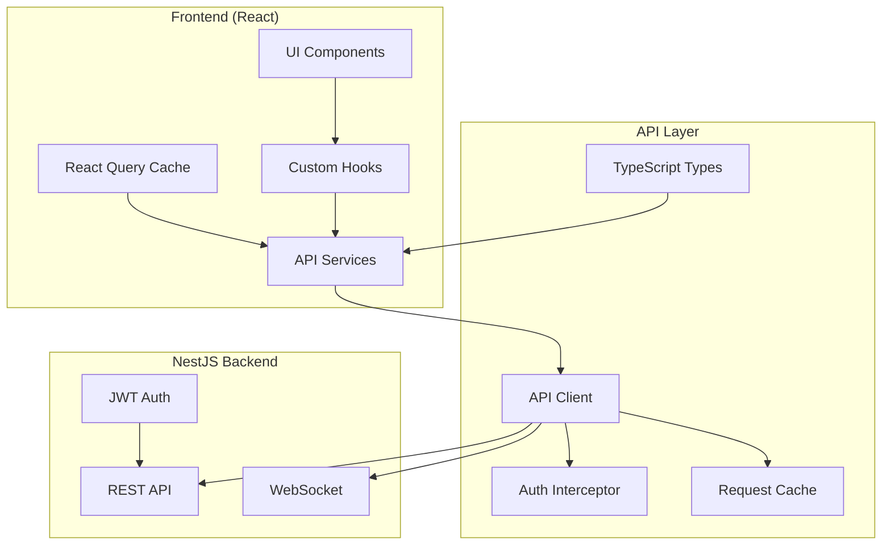

# Design Document: NestJS Backend Integration

## Overview

This design document outlines the architecture and implementation approach for integrating the React frontend with the NestJS backend API. The integration will replace the current Supabase-based data layer with a comprehensive API client that communicates with the NestJS backend while maintaining all existing UI functionality.

## Architecture

### High-Level Architecture



### Service Layer Architecture

The integration will follow a layered architecture pattern:

1. **UI Layer**: Existing React components (no changes to UI elements)
2. **Hook Layer**: Custom React hooks for state management
3. **Service Layer**: Business logic and API orchestration
4. **API Client Layer**: HTTP client with authentication and error handling
5. **Type Layer**: TypeScript interfaces and DTOs

## Components and Interfaces

### API Client Core

```typescript
interface APIClientConfig {
  baseURL: string;
  timeout: number;
  retryAttempts: number;
  retryDelay: number;
}

interface APIResponse<T> {
  success: boolean;
  data?: T;
  error?: APIError;
  message?: string;
}

interface APIError {
  code: string;
  message: string;
  details?: any;
  statusCode: number;
}
```

### Authentication Service

```typescript
interface AuthTokens {
  accessToken: string;
  refreshToken: string;
  expiresIn: number;
}

interface User {
  id: string;
  email: string;
  name: string;
  role: string;
  isEmailVerified: boolean;
  createdAt: string;
}

interface AuthService {
  login(email: string, password: string): Promise<AuthResponse>;
  register(email: string, password: string, name?: string): Promise<AuthResponse>;
  logout(): Promise<void>;
  refreshToken(): Promise<AuthTokens>;
  getCurrentUser(): User | null;
  isAuthenticated(): boolean;
}
```

### URL Management Service

```typescript
interface CreateURLRequest {
  originalUrl: string;
  customAlias?: string;
  title?: string;
  description?: string;
  tags?: string[];
  expiresAt?: string;
  password?: string;
  passwordHint?: string;
  iosUrl?: string;
  androidUrl?: string;
  utmSource?: string;
  utmMedium?: string;
  utmCampaign?: string;
  utmTerm?: string;
  utmContent?: string;
}

interface URL {
  id: string;
  shortCode: string;
  shortUrl: string;
  originalUrl: string;
  customAlias?: string;
  title?: string;
  description?: string;
  tags: string[];
  clickCount: number;
  isActive: boolean;
  expiresAt?: string;
  createdAt: string;
  updatedAt: string;
}

interface URLService {
  createURL(data: CreateURLRequest): Promise<URL>;
  getURLs(params: URLListParams): Promise<PaginatedResponse<URL>>;
  getURL(id: string): Promise<URL>;
  updateURL(id: string, data: Partial<CreateURLRequest>): Promise<URL>;
  deleteURL(id: string): Promise<void>;
  generateQRCode(id: string, options?: QRCodeOptions): Promise<QRCodeResponse>;
}
```

### Analytics Service

```typescript
interface AnalyticsSummary {
  totalClicks: number;
  uniqueVisitors: number;
  averageClicksPerDay: number;
  conversionRate: number;
}

interface AnalyticsData {
  summary: AnalyticsSummary;
  clicksByDate: DateClickData[];
  deviceBreakdown: DeviceBreakdown;
  browserBreakdown: Record<string, number>;
  osBreakdown: Record<string, number>;
  geographicData: GeographicData[];
  topReferrers: ReferrerData[];
  utmAnalytics: UTMAnalytics;
}

interface AnalyticsService {
  getURLAnalytics(urlId: string, params: AnalyticsParams): Promise<AnalyticsData>;
  getDashboardAnalytics(params: DashboardAnalyticsParams): Promise<DashboardAnalytics>;
  getRealTimeAnalytics(urlId: string): Promise<RealTimeAnalytics>;
  subscribeToRealTime(urlId: string, callback: (data: RealTimeUpdate) => void): () => void;
}
```

### Bio Page Service

```typescript
interface BioPage {
  id: string;
  username: string;
  title?: string;
  bio?: string;
  avatarUrl?: string;
  theme: string;
  backgroundColor?: string;
  textColor?: string;
  buttonStyle?: string;
  isPublic: boolean;
  bioPageUrl: string;
  createdAt: string;
  updatedAt: string;
}

interface BioLink {
  id: string;
  title: string;
  url: string;
  icon?: string;
  position: number;
  isActive: boolean;
  clickCount: number;
}

interface BioService {
  createBioPage(data: CreateBioPageRequest): Promise<BioPage>;
  getBioPage(id: string): Promise<BioPage>;
  getPublicBioPage(username: string): Promise<PublicBioPage>;
  updateBioPage(id: string, data: Partial<CreateBioPageRequest>): Promise<BioPage>;
  addBioLinks(bioPageId: string, links: CreateBioLinkRequest[]): Promise<BioLink[]>;
  updateBioLink(linkId: string, data: Partial<CreateBioLinkRequest>): Promise<BioLink>;
  deleteBioLink(linkId: string): Promise<void>;
  reorderBioLinks(bioPageId: string, linkOrders: LinkOrder[]): Promise<void>;
}
```

## Data Models

### Request/Response Types

```typescript
interface PaginatedResponse<T> {
  data: T[];
  pagination: {
    total: number;
    page: number;
    limit: number;
    pages: number;
    hasNext: boolean;
    hasPrev: boolean;
  };
}

interface URLListParams {
  page?: number;
  limit?: number;
  sortBy?: string;
  order?: 'asc' | 'desc';
  search?: string;
  tags?: string[];
  tagOperator?: 'AND' | 'OR';
  isActive?: boolean;
}

interface AnalyticsParams {
  startDate?: string;
  endDate?: string;
  granularity?: 'hour' | 'day' | 'week' | 'month';
}
```

### Error Handling Types

```typescript
interface ValidationError {
  field: string;
  message: string;
}

interface APIErrorResponse {
  success: false;
  error: {
    code: string;
    message: string;
    details?: ValidationError[];
  };
  statusCode: number;
  timestamp: string;
  path: string;
}
```

## Implementation Strategy

### Phase 1: Core Infrastructure
1. Set up API client with Axios
2. Implement authentication service with JWT handling
3. Create base service classes with error handling
4. Set up React Query for caching and state management

### Phase 2: Authentication Integration
1. Replace Supabase auth with NestJS auth service
2. Update useAuth hook to use new auth service
3. Implement token refresh logic
4. Update auth guards and redirects

### Phase 3: URL Management
1. Implement URL service with all CRUD operations
2. Update LinkShortener component to use new service
3. Update RecentLinks component with new data fetching
4. Implement search and filtering functionality

### Phase 4: Analytics Integration
1. Implement analytics service
2. Update dashboard charts with new data source
3. Implement real-time analytics with WebSocket
4. Update analytics components

### Phase 5: Bio Pages and Advanced Features
1. Implement bio page service
2. Update bio page components
3. Implement tag management
4. Implement bulk operations

### Phase 6: Testing and Optimization
1. Add comprehensive error handling
2. Implement loading states
3. Add request caching optimization
4. Performance testing and optimization

## Error Handling Strategy

### HTTP Error Handling
```typescript
class APIClient {
  private handleError(error: AxiosError): APIError {
    if (error.response) {
      // Server responded with error status
      return {
        code: error.response.data?.error?.code || 'SERVER_ERROR',
        message: error.response.data?.error?.message || 'Server error occurred',
        statusCode: error.response.status,
        details: error.response.data?.error?.details
      };
    } else if (error.request) {
      // Network error
      return {
        code: 'NETWORK_ERROR',
        message: 'Network connection failed',
        statusCode: 0
      };
    } else {
      // Request setup error
      return {
        code: 'REQUEST_ERROR',
        message: error.message,
        statusCode: 0
      };
    }
  }
}
```

### Retry Logic
```typescript
interface RetryConfig {
  attempts: number;
  delay: number;
  backoffFactor: number;
  retryCondition: (error: APIError) => boolean;
}

const defaultRetryConfig: RetryConfig = {
  attempts: 3,
  delay: 1000,
  backoffFactor: 2,
  retryCondition: (error) => error.statusCode >= 500 || error.code === 'NETWORK_ERROR'
};
```

### Authentication Error Handling
```typescript
class AuthInterceptor {
  private async handleAuthError(error: AxiosError): Promise<AxiosResponse> {
    if (error.response?.status === 401) {
      try {
        await this.authService.refreshToken();
        // Retry original request with new token
        return this.apiClient.request(error.config);
      } catch (refreshError) {
        // Refresh failed, redirect to login
        this.authService.logout();
        window.location.href = '/login';
        throw refreshError;
      }
    }
    throw error;
  }
}
```

## Correctness Properties

*A property is a characteristic or behavior that should hold true across all valid executions of a system-essentially, a formal statement about what the system should do. Properties serve as the bridge between human-readable specifications and machine-verifiable correctness guarantees.*

### Property 1: API Endpoint Mapping Consistency
*For any* service method that performs a backend operation, calling that method should result in exactly one HTTP request to the corresponding NestJS backend endpoint with the correct HTTP method and path.
**Validates: Requirements 1.1, 1.2, 1.4, 2.1, 2.3, 2.4, 3.1, 3.2, 4.1, 4.2, 4.3, 4.4, 5.1, 5.2, 6.1, 6.2**

### Property 2: Authentication Token Inclusion
*For any* authenticated API request, the HTTP request should include a valid JWT token in the Authorization header.
**Validates: Requirements 1.5**

### Property 3: Token Refresh Automation
*For any* API request that receives a 401 unauthorized response due to token expiration, the system should automatically attempt token refresh and retry the original request exactly once.
**Validates: Requirements 1.3**

### Property 4: Parameter Preservation
*For any* API call with parameters (search, pagination, filters, date ranges), all provided parameters should be correctly included in the HTTP request without modification or loss.
**Validates: Requirements 2.2, 2.5, 3.4, 5.3, 6.3**

### Property 5: Comprehensive Error Handling
*For any* API request that fails, the system should handle the error gracefully by displaying appropriate user messages, logging detailed information, and taking correct recovery actions based on the error type.
**Validates: Requirements 1.6, 2.6, 4.5, 7.2, 7.4, 7.5, 8.3, 9.4**

### Property 6: Loading State Management
*For any* API request in progress, the UI should display appropriate loading indicators that are cleared when the request completes (success or failure).
**Validates: Requirements 7.1**

### Property 7: Network Resilience
*For any* network error or timeout, the system should implement exponential backoff retry logic up to the configured maximum attempts before failing.
**Validates: Requirements 7.3**

### Property 8: Configuration Validation
*For any* required environment variable, the system should validate its presence and format at startup and provide clear error messages for missing or invalid configuration.
**Validates: Requirements 8.1, 8.2, 8.4**

### Property 9: Data Type Consistency
*For any* data exchanged with the backend, the frontend TypeScript types should match the backend DTOs, and date/time values should be formatted consistently.
**Validates: Requirements 9.1, 9.2, 9.3**

### Property 10: Response Validation
*For any* API response received, the response structure should be validated against the expected schema before being used by the application.
**Validates: Requirements 9.2**

### Property 11: Caching Efficiency
*For any* identical API request made within the cache timeout period, the second request should return cached data without making an HTTP call.
**Validates: Requirements 10.1, 10.2**

### Property 12: Optimistic Updates
*For any* user action that modifies data, the UI should update immediately (optimistically) and revert changes only if the API request fails.
**Validates: Requirements 10.3**

### Property 13: Pagination Consistency
*For any* paginated data request, the system should correctly handle page boundaries and maintain consistent pagination state across navigation.
**Validates: Requirements 10.5**

### Property 14: WebSocket Connection Management
*For any* real-time feature requiring WebSocket connection, the system should establish connections when needed, handle disconnections gracefully, and implement automatic reconnection with exponential backoff.
**Validates: Requirements 3.5**

### Property 15: Bulk Operation Status Tracking
*For any* bulk operation (import/export), the system should correctly track job status through polling and provide accurate progress updates to the user.
**Validates: Requirements 6.3, 6.4**

## Testing Strategy

### Unit Testing
- Test all service methods with mocked API responses
- Test error handling scenarios
- Test authentication token management
- Test data transformation logic

### Integration Testing
- Test API client with real backend endpoints
- Test authentication flow end-to-end
- Test data fetching and caching behavior
- Test WebSocket connections

### Property-Based Testing
- Each correctness property must be implemented as a property-based test
- Minimum 100 iterations per property test
- Tests should generate random valid inputs to verify universal properties
- Property tests should be tagged with: **Feature: nestjs-backend-integration, Property {number}: {property_text}**

## Performance Considerations

### Caching Strategy
```typescript
const queryClient = new QueryClient({
  defaultOptions: {
    queries: {
      staleTime: 5 * 60 * 1000, // 5 minutes
      cacheTime: 10 * 60 * 1000, // 10 minutes
      retry: (failureCount, error) => {
        if (error.status === 404) return false;
        return failureCount < 3;
      }
    }
  }
});
```

### Request Optimization
- Implement request deduplication
- Use optimistic updates for better UX
- Batch related API calls when possible
- Implement pagination for large datasets

### WebSocket Management
```typescript
class WebSocketManager {
  private connections: Map<string, WebSocket> = new Map();
  
  subscribe(channel: string, callback: (data: any) => void): () => void {
    // Implement WebSocket connection management
    // Return unsubscribe function
  }
  
  private handleReconnection(channel: string): void {
    // Implement automatic reconnection with exponential backoff
  }
}
```

## Security Considerations

### Token Management
- Store JWT tokens securely in httpOnly cookies when possible
- Implement automatic token refresh
- Clear tokens on logout and authentication errors
- Validate token expiration before requests

### Request Security
- Validate all input data before sending to API
- Sanitize user input to prevent XSS
- Implement CSRF protection
- Use HTTPS for all API communications

### Error Information
- Avoid exposing sensitive information in error messages
- Log detailed errors on client side for debugging
- Implement rate limiting awareness
- Handle security-related errors appropriately